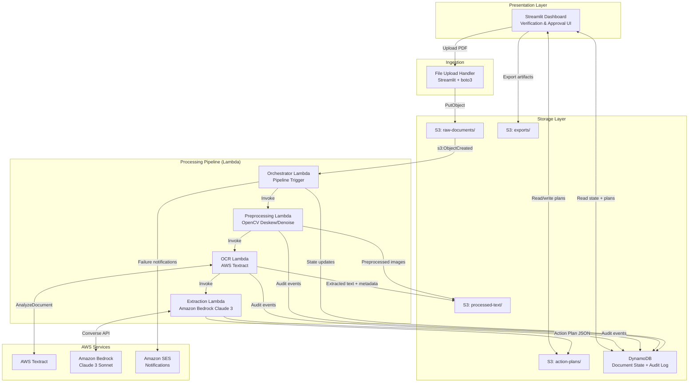
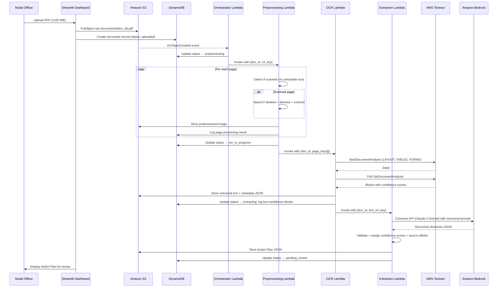
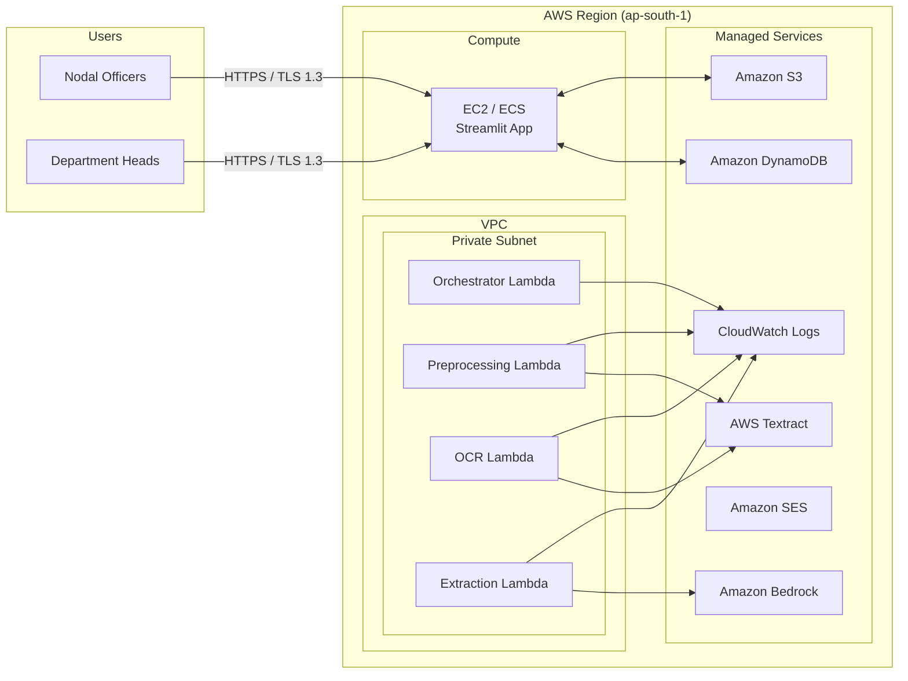

# Design Document

## Court Judgments to Verified Action Plans

**Feature:** court-judgment-action-plans  
**Spec Type:** Feature  
**Workflow:** Requirements-First  
**Commissioned by:** Centre for e-Governance, Government of India (AI for Bharat Hackathon — Theme 11)

---

## Overview

This system is an end-to-end AI pipeline that transforms court judgment PDFs into verified, structured executive action plans. It addresses the manual bottleneck faced by government Nodal Officers who must read lengthy court orders, identify compliance obligations, and communicate them to departments — a process that is slow, inconsistent, and error-prone at scale.

The pipeline ingests both digitally-born and scanned PDFs, applies computer vision preprocessing where needed, performs high-accuracy OCR via AWS Textract, and uses Amazon Bedrock (Claude 3) to extract structured legal directives. A Streamlit-based Human-in-the-Loop (HiTL) verification dashboard allows Nodal Officers and Department Heads to review, edit, approve, and export action plans with a full audit trail.

### Design Goals

- **Accuracy over speed**: Legal directives carry compliance obligations; the system prioritises extraction fidelity and traceability over throughput.
- **Human authority**: AI extraction is advisory. Every action plan requires human verification before it becomes authoritative.
- **Auditability**: Every state transition, edit, and decision is immutably logged to meet government accountability standards.
- **Resilience**: Each pipeline stage retries independently with exponential backoff; a failure in one stage does not corrupt other documents.
- **Separation of concerns**: The processing pipeline (Lambda-based) is decoupled from the presentation layer (Streamlit), communicating only through S3 and a lightweight state store.

### Key Research Findings

- **AWS Textract** supports asynchronous document analysis (`start_document_analysis` / `get_document_analysis`) for multi-page PDFs stored in S3, returning structured blocks with confidence scores and positional metadata. The `LAYOUT` feature type preserves reading order across complex legal document layouts. ([AWS Textract Developer Guide](https://docs.aws.amazon.com/textract/latest/dg/))
- **Amazon Bedrock Converse API** (`bedrock-runtime.converse`) provides a unified interface for Claude 3 models with structured JSON output support, making it well-suited for directive extraction with schema-constrained responses. ([AWS Bedrock Docs](https://docs.aws.amazon.com/bedrock/latest/userguide/conversation-inference-examples.html))
- **OpenCV** deskewing pipeline: grayscale → Gaussian blur → Otsu threshold → morphological dilation → Hough line detection → affine rotation correction. This sequence reliably corrects skew angles up to ±15° in scanned legal documents. ([Dynamsoft, 2023](https://dynamsoft.com/codepool/deskew-scanned-document.html))
- **S3 → Lambda event triggers** fire on `s3:ObjectCreated:Put` events, passing the bucket name and object key in the event payload, enabling fully automated pipeline invocation without polling. ([AWS Lambda Python Guide](https://docs.aws.amazon.com/lambda/latest/dg/lambda-python.html))
- **Streamlit** `st.data_editor` supports inline editing of tabular data with session state persistence, making it suitable for the directive review table without requiring a separate frontend framework.

---

## Architecture

### System Architecture Overview

The system follows an **event-driven, serverless processing pipeline** decoupled from a **stateful web dashboard**. The two halves communicate through Amazon S3 (artifact storage) and Amazon DynamoDB (document state and audit log).



### Processing Pipeline Detail



### Deployment Architecture



---

## Components and Interfaces

### 1. Document Ingestion Service (Streamlit + boto3)

**Responsibility:** Accept PDF uploads from the dashboard, validate them, store them in S3, and create the initial document record.

**Interface:**

```python
class DocumentIngestionService:
    def upload_document(
        self,
        file_bytes: bytes,
        filename: str,
        uploader_id: str,
        department_id: str,
    ) -> UploadResult:
        """
        Validates file type and size, uploads to S3 raw-documents/ prefix,
        creates DynamoDB document record, and writes initial audit log entry.
        
        Returns: UploadResult with doc_id, s3_key, and status.
        Raises: ValidationError for invalid file type or size.
        """
```

**Validation Rules:**
- MIME type must be `application/pdf` (validated via `python-magic`, not file extension)
- File size must not exceed 100 MB (104,857,600 bytes)
- Filename is sanitised (alphanumeric, hyphens, underscores only) before use as S3 key component

**S3 Key Pattern:** `raw-documents/{department_id}/{doc_id}/{sanitised_filename}.pdf`

---

### 2. Preprocessing Engine (Lambda + OpenCV)

**Responsibility:** Convert PDF pages to images, detect scanned pages, and apply image corrections to maximise OCR accuracy.

**Interface:**

```python
def lambda_handler(event: dict, context: LambdaContext) -> PreprocessingResult:
    """
    Event payload:
    {
        "doc_id": str,
        "s3_bucket": str,
        "s3_key": str,          # path to raw PDF
        "department_id": str
    }
    
    Returns PreprocessingResult with per-page outcomes and S3 keys
    for preprocessed images.
    """
```

**Processing Steps per Page:**

1. **PDF to image**: Convert each page to a PIL/NumPy image at 300 DPI using `pdf2image` (wraps `poppler`)
2. **Scan detection**: Check for selectable text layer using `PyMuPDF` (`fitz`). Pages without a text layer are treated as scanned.
3. **For scanned pages — OpenCV pipeline:**
   - Grayscale conversion: `cv2.cvtColor(img, cv2.COLOR_BGR2GRAY)`
   - Gaussian blur: `cv2.GaussianBlur(gray, (5, 5), 0)` — reduces noise before thresholding
   - Otsu thresholding: `cv2.threshold(..., cv2.THRESH_BINARY + cv2.THRESH_OTSU)` — binarises image
   - Morphological dilation: `cv2.dilate(thresh, kernel, iterations=1)` — connects text components
   - Hough line detection: `cv2.HoughLinesP(...)` — detects dominant text line angles
   - Skew angle calculation: median angle of detected lines
   - Affine rotation: `cv2.warpAffine(img, rotation_matrix, ...)` — corrects skew
   - CLAHE contrast enhancement: `cv2.createCLAHE(clipLimit=2.0).apply(gray)` — improves contrast for low-quality scans
4. **Output**: Store preprocessed PNG at 300 DPI to `processed-text/{doc_id}/pages/page_{n:04d}.png`

**Failure Handling:** Per-page failures are logged to DynamoDB and do not block other pages. If >50% of pages fail preprocessing, the document is marked `failed`.

---

### 3. OCR Engine (Lambda + AWS Textract)

**Responsibility:** Submit preprocessed page images to AWS Textract, retrieve structured text with positional metadata, and flag low-confidence blocks.

**Interface:**

```python
def lambda_handler(event: dict, context: LambdaContext) -> OCRResult:
    """
    Event payload:
    {
        "doc_id": str,
        "s3_bucket": str,
        "page_keys": list[str],   # S3 keys for preprocessed page images
        "department_id": str
    }
    """
```

**Textract Integration:**

- Uses `start_document_analysis` with `FeatureTypes: ["LAYOUT", "TABLES", "FORMS"]` for multi-page documents
- Polls `get_document_analysis` with exponential backoff (initial delay 5s, max 3 retries per API call)
- Reconstructs reading order from `LAYOUT` block relationships
- Flags any `WORD` or `LINE` block with `Confidence < 80.0` in the OCR metadata record

**Output Schema (stored as `processed-text/{doc_id}/ocr_result.json`):**

```json
{
  "doc_id": "string",
  "pages": [
    {
      "page_number": 1,
      "text": "string",
      "blocks": [
        {
          "block_id": "string",
          "block_type": "LINE | WORD | TABLE | CELL",
          "text": "string",
          "confidence": 0.95,
          "geometry": {
            "bounding_box": { "left": 0.1, "top": 0.05, "width": 0.8, "height": 0.02 }
          },
          "page": 1,
          "char_offset_start": 0,
          "char_offset_end": 42,
          "low_confidence_flag": false
        }
      ],
      "low_confidence_block_count": 0
    }
  ],
  "full_text": "string",
  "total_pages": 10,
  "processing_timestamp": "ISO8601"
}
```

**Retry Policy:** Up to 3 retries with exponential backoff (5s, 10s, 20s) on `ProvisionedThroughputExceededException` or service unavailability. After exhausting retries, document status is set to `failed` and the Nodal Officer is notified via SES.

---

### 4. Directive Extractor (Lambda + Amazon Bedrock)

**Responsibility:** Submit extracted text to Claude 3 Sonnet via the Bedrock Converse API with a structured prompt, parse the response into validated Directive objects, and produce the Action Plan JSON.

**Interface:**

```python
def lambda_handler(event: dict, context: LambdaContext) -> ExtractionResult:
    """
    Event payload:
    {
        "doc_id": str,
        "s3_bucket": str,
        "ocr_result_key": str,
        "department_id": str
    }
    """
```

**Prompt Design:**

The system prompt instructs Claude 3 to act as a legal document analyst. The user message contains the full OCR text with page markers. The prompt enforces:

1. Extract only directives explicitly stated in the text — no inference or hallucination
2. For each directive, return: `order_description`, `deadline`, `responsible_party`, `category`, `source_page`, `source_char_offset_start`, `source_char_offset_end`
3. Return a JSON array conforming to the `DirectiveList` schema
4. Set `deadline` to `null` if not explicitly stated
5. Assign a `confidence_score` (0.0–1.0) based on clarity and unambiguity of the directive in the source text

**Bedrock API Call:**

```python
response = bedrock_client.converse(
    modelId="anthropic.claude-3-sonnet-20240229-v1:0",
    system=[{"text": SYSTEM_PROMPT}],
    messages=[{"role": "user", "content": [{"text": document_text_with_markers}]}],
    inferenceConfig={"maxTokens": 4096, "temperature": 0.0},
)
```

`temperature=0.0` is used to maximise determinism and reduce hallucination risk.

**Source Traceability Validation:** After receiving the response, the extractor validates that each directive's `source_char_offset_start` and `source_char_offset_end` correspond to a real substring in the OCR text. Directives that fail this check are flagged with `traceability_verified: false` and a low confidence score.

**Retry Policy:** Up to 3 retries with exponential backoff on Bedrock throttling or service errors.

---

### 5. Verification Dashboard (Streamlit)

**Responsibility:** Provide the HiTL interface for Nodal Officers and Department Heads to review, edit, approve, reject, and export action plans.

**Page Structure:**

```
app/
├── main.py                    # Entry point, auth gate, navigation
├── pages/
│   ├── 01_upload.py           # Document upload
│   ├── 02_documents.py        # Document list + status tracking
│   ├── 03_review.py           # Directive review and editing (Nodal Officer)
│   ├── 04_approval.py         # Final approval (Department Head)
│   └── 05_audit.py            # Audit trail viewer
├── components/
│   ├── directive_table.py     # Reusable directive editor component
│   ├── status_badge.py        # Processing status indicator
│   └── confidence_indicator.py
├── services/
│   ├── auth_service.py        # Role-based access control
│   ├── document_service.py    # DynamoDB + S3 read/write
│   └── export_service.py      # PDF + JSON export generation
└── utils/
    ├── pdf_generator.py       # ReportLab-based PDF export
    └── validators.py
```

**Key UI Behaviours:**

- **Directive table**: Rendered with `st.data_editor` for inline editing. Rows with `confidence_score < 0.60` are highlighted in amber using conditional row styling.
- **Status polling**: Dashboard polls DynamoDB every 5 seconds for documents in active processing states (`preprocessing`, `ocr_in_progress`, `extracting`) using `st.rerun()` with a timer.
- **Role enforcement**: `st.session_state["user_role"]` is checked before rendering edit controls. Department Heads see approve/reject buttons; Nodal Officers see edit/submit controls.
- **Lock mechanism**: Verified action plans display a lock icon. An explicit "Unlock for editing" button triggers a confirmation dialog and writes an audit log entry before re-enabling edits.

---

### 6. Audit Log Service

**Responsibility:** Provide an append-only audit trail for all document state transitions and user actions.

**DynamoDB Table Design:**

- **Table name:** `court-judgment-audit-log`
- **Partition key:** `doc_id` (String)
- **Sort key:** `event_timestamp#event_id` (String) — ISO8601 timestamp + UUID, ensures chronological ordering and uniqueness
- **GSI:** `actor_id-index` on `actor_id` for per-user audit queries

**Audit Event Schema:**

```json
{
  "doc_id": "string",
  "event_timestamp#event_id": "2024-01-15T10:30:00Z#uuid4",
  "event_type": "STATE_TRANSITION | DIRECTIVE_EDIT | DIRECTIVE_ADD | DIRECTIVE_DELETE | EXPORT | UNLOCK | AUTH_FAILURE",
  "actor_id": "string",
  "actor_role": "nodal_officer | department_head | system",
  "previous_state": "string | null",
  "new_state": "string | null",
  "field_name": "string | null",
  "previous_value": "any | null",
  "new_value": "any | null",
  "metadata": {}
}
```

**Immutability:** DynamoDB items are written once and never updated. The dashboard's `document_service.py` only calls `put_item` (never `update_item`) for audit records. IAM policies deny `dynamodb:DeleteItem` and `dynamodb:UpdateItem` on the audit table for all application roles.

---

## Data Models

### Document Record (DynamoDB: `court-judgment-documents`)

```json
{
  "doc_id": "uuid4",
  "department_id": "string",
  "uploader_id": "string",
  "original_filename": "string",
  "s3_key_raw": "string",
  "s3_key_ocr_result": "string | null",
  "s3_key_action_plan": "string | null",
  "upload_timestamp": "ISO8601",
  "status": "uploaded | preprocessing | ocr_in_progress | extracting | pending_review | verified | approved | rejected | failed",
  "page_count": "integer | null",
  "failed_pages": ["integer"],
  "low_confidence_ocr_pages": ["integer"],
  "processing_error": "string | null",
  "verified_by": "string | null",
  "verified_at": "ISO8601 | null",
  "approved_by": "string | null",
  "approved_at": "ISO8601 | null",
  "rejection_reason": "string | null",
  "ttl": "epoch_seconds | null"
}
```

### Action Plan (S3 JSON: `action-plans/{doc_id}/action_plan.json`)

```json
{
  "action_plan_id": "uuid4",
  "doc_id": "uuid4",
  "case_reference": "string | null",
  "court_name": "string | null",
  "judgment_date": "ISO8601 | null",
  "extraction_timestamp": "ISO8601",
  "status": "pending_review | verified | approved | rejected",
  "directives": [
    {
      "directive_id": "uuid4",
      "order_description": "string",
      "deadline": "ISO8601 | duration_string | null",
      "responsible_party": "string",
      "category": "compliance | reporting | payment | infrastructure | other",
      "confidence_score": 0.87,
      "source_page": 3,
      "source_char_offset_start": 1420,
      "source_char_offset_end": 1612,
      "source_excerpt": "string",
      "traceability_verified": true,
      "manually_added": false,
      "edit_history": [
        {
          "edited_by": "string",
          "edited_at": "ISO8601",
          "field": "string",
          "previous_value": "any",
          "new_value": "any"
        }
      ]
    }
  ],
  "verification": {
    "verified_by": "string | null",
    "verified_at": "ISO8601 | null",
    "notes": "string | null"
  },
  "approval": {
    "approved_by": "string | null",
    "approved_at": "ISO8601 | null",
    "comment": "string | null"
  }
}
```

### User Record (DynamoDB: `court-judgment-users`)

```json
{
  "user_id": "string",
  "email": "string",
  "full_name": "string",
  "role": "nodal_officer | department_head | admin",
  "department_id": "string",
  "is_active": true,
  "created_at": "ISO8601",
  "last_login": "ISO8601 | null"
}
```

### Processing Event (Lambda → DynamoDB write)

```json
{
  "doc_id": "string",
  "stage": "preprocessing | ocr | extraction",
  "page_number": "integer | null",
  "event_type": "PAGE_PROCESSED | PAGE_FAILED | STAGE_COMPLETE | STAGE_FAILED | LOW_CONFIDENCE_BLOCK",
  "details": {},
  "timestamp": "ISO8601"
}
```

### S3 Bucket Structure

```
court-judgment-{env}/
├── raw-documents/
│   └── {department_id}/{doc_id}/{filename}.pdf
├── processed-text/
│   └── {doc_id}/
│       ├── pages/
│       │   └── page_{nnnn}.png
│       └── ocr_result.json
├── action-plans/
│   └── {doc_id}/
│       └── action_plan.json
└── exports/
    └── {doc_id}/
        ├── action_plan_{doc_id}.pdf
        └── action_plan_{doc_id}.json
```

---

## Correctness Properties

*A property is a characteristic or behavior that should hold true across all valid executions of a system — essentially, a formal statement about what the system should do. Properties serve as the bridge between human-readable specifications and machine-verifiable correctness guarantees.*


### Property 1: Upload Validation Rejects Invalid Files

*For any* file submitted to the Document Ingestion Service, if the file's size exceeds 100 MB or its MIME type is not `application/pdf`, the service SHALL return a rejection result with a descriptive error message and SHALL NOT create a document record or write to S3.

**Validates: Requirements 1.3, 1.4**

---

### Property 2: Uploaded Documents Receive Unique Identifiers

*For any* batch of N valid PDF uploads processed by the Document Ingestion Service, all N resulting `doc_id` values SHALL be distinct, and each corresponding Audit_Log entry SHALL contain a non-null `upload_timestamp`.

**Validates: Requirements 1.5**

---

### Property 3: Scanned Pages Trigger Preprocessing; Page Failures Are Isolated

*For any* document with N pages where page K is identified as scanned, the Preprocessing Engine SHALL invoke the OpenCV correction pipeline for page K. Furthermore, *for any* document where page K fails preprocessing, the remaining N-1 pages SHALL still be processed and produce valid output images.

**Validates: Requirements 2.1, 2.2**

---

### Property 4: Preprocessed Images Meet Minimum Resolution

*For any* page processed by the Preprocessing Engine (whether scanned or digital), the output image SHALL have a DPI value of at least 300 in both horizontal and vertical dimensions.

**Validates: Requirements 2.4**

---

### Property 5: OCR Reading Order Is Preserved

*For any* set of AWS Textract LAYOUT blocks with defined sequential relationships, the OCR Engine's text reconstruction SHALL produce a string where the text content of block N appears before the text content of block N+1, as determined by Textract's layout ordering.

**Validates: Requirements 3.2**

---

### Property 6: Low-Confidence OCR Blocks Are Flagged

*For any* text block returned by AWS Textract with a `Confidence` value strictly below 80.0, the OCR Engine SHALL set `low_confidence_flag = true` on that block in the OCR result. *For any* block with `Confidence` ≥ 80.0, `low_confidence_flag` SHALL be `false`.

**Validates: Requirements 3.3**

---

### Property 7: Extracted Directives Conform to Schema

*For any* directive produced by the Directive Extractor, the directive object SHALL contain all four required fields (`order_description`, `deadline`, `responsible_party`, `category`), the `deadline` field SHALL be either a valid date/duration string or `null`, and the `confidence_score` SHALL satisfy `0.0 ≤ confidence_score ≤ 1.0`.

**Validates: Requirements 4.2, 4.3, 4.4**

---

### Property 8: Directives Are Traceable to Source Text

*For any* directive produced by the Directive Extractor with `traceability_verified = true`, the substring of the OCR full text from `source_char_offset_start` to `source_char_offset_end` SHALL be non-empty and SHALL appear verbatim in the source document text at the indicated `source_page`.

**Validates: Requirements 4.7**

---

### Property 9: Directive Table Renders All Directives

*For any* Action Plan containing N directives, the Verification Dashboard's directive table component SHALL render exactly N rows, and each row SHALL display the `order_description`, `deadline`, `responsible_party`, `category`, and `confidence_score` fields.

**Validates: Requirements 5.1**

---

### Property 10: Low-Confidence Directives Are Visually Highlighted

*For any* directive with `confidence_score < 0.60`, the rendered table row SHALL include a visual highlight indicator. *For any* directive with `confidence_score ≥ 0.60`, no such highlight SHALL be present.

**Validates: Requirements 5.7**

---

### Property 11: State Machine Edit Permissions

*For any* Action Plan with `status = verified`, any attempt to edit, add, or delete a directive SHALL be rejected by the service layer unless a preceding `UNLOCK` audit event exists for that document. *For any* Action Plan with `status = rejected`, the Nodal Officer SHALL be permitted to edit directives and resubmit for verification.

**Validates: Requirements 5.6, 6.5**

---

### Property 12: Approval Workflow State Transitions

*For any* Action Plan with `status = verified`, it SHALL appear in the Department Head's approval queue. *For any* approval action by a `department_head` role user, the Action Plan `status` SHALL become `approved` and the Audit_Log SHALL contain an entry with the actor's identity, timestamp, and `new_state = approved`. *For any* rejection action, the `status` SHALL become `rejected` and the Audit_Log SHALL contain the rejection reason.

**Validates: Requirements 6.1, 6.3, 6.4**

---

### Property 13: Export Contains Required Content

*For any* approved Action Plan, the generated PDF export SHALL contain: document title, case reference, extraction date, approval details (approver identity and timestamp), a table of all directives, and an Audit_Log summary section. The JSON export SHALL be a valid JSON document conforming to the Action Plan schema.

**Validates: Requirements 7.2, 9.5**

---

### Property 14: Pipeline Stages Receive Required Context

*For any* pipeline invocation triggered by a document upload, each Lambda stage (Preprocessing, OCR, Extraction) SHALL receive an event payload containing a non-null `doc_id` and a non-null `s3_key` pointing to the relevant artifact.

**Validates: Requirements 8.2**

---

### Property 15: Pipeline Failure Updates Document Status

*For any* pipeline stage that raises an unrecoverable error after exhausting all retry attempts, the document's `status` in DynamoDB SHALL be updated to `failed`, and the Audit_Log SHALL contain a failure record identifying the stage and error details.

**Validates: Requirements 8.3**

---

### Property 16: Dashboard Reflects Current Document Status

*For any* document with a given `status` value in DynamoDB, the Verification Dashboard's document list SHALL display that same status value for that document.

**Validates: Requirements 8.4**

---

### Property 17: State Transitions Are Fully Audited

*For any* document state transition (from any state to any other state), the Audit_Log SHALL contain an entry with non-null values for `actor_id`, `event_type`, `event_timestamp`, `previous_state`, and `new_state`.

**Validates: Requirements 9.1**

---

### Property 18: Directive Edits Are Fully Audited

*For any* edit to a directive field during the verification process, the Audit_Log SHALL contain an entry with non-null values for `actor_id`, `field_name`, `previous_value`, and `new_value`.

**Validates: Requirements 9.2**

---

### Property 19: Audit Log Is Immutable

*For any* user with role `nodal_officer`, `department_head`, or `admin`, any attempt to delete or update an existing Audit_Log entry through the application service layer SHALL be rejected with an authorization error.

**Validates: Requirements 9.4**

---

### Property 20: Department-Based Access Control

*For any* user-document pair where the user's `department_id` does not match the document's `department_id`, the system SHALL deny access to that document regardless of the user's role.

**Validates: Requirements 10.2**

---

### Property 21: Role-Based Action Denial Is Logged

*For any* (user_role, action) pair where the action is not in the role's permission set, the system SHALL deny the action and SHALL record an `AUTH_FAILURE` event in the Audit_Log containing the user's identity, the attempted action, and a timestamp.

**Validates: Requirements 10.3**

---

## Error Handling

### Pipeline Error Handling Strategy

Each Lambda stage implements a consistent error handling pattern:

```
try:
    result = perform_stage_work(event)
    update_document_status(doc_id, next_status)
    write_audit_event(doc_id, "STAGE_COMPLETE", ...)
    return result
except RetryableError as e:
    if attempt < MAX_RETRIES:
        sleep(backoff_delay(attempt))
        raise  # Lambda retry or explicit re-invoke
    else:
        update_document_status(doc_id, "failed")
        write_audit_event(doc_id, "STAGE_FAILED", error=str(e))
        notify_nodal_officer(doc_id, e)
        raise
except NonRetryableError as e:
    update_document_status(doc_id, "failed")
    write_audit_event(doc_id, "STAGE_FAILED", error=str(e))
    notify_nodal_officer(doc_id, e)
    raise
```

### Error Categories

| Error Type | Examples | Handling |
|---|---|---|
| **Validation Error** | File too large, wrong MIME type | Immediate rejection, user-facing message, no retry |
| **Retryable Service Error** | Textract throttling, Bedrock 503, S3 timeout | Exponential backoff, up to 3 retries (5s, 10s, 20s) |
| **Non-Retryable Service Error** | Textract `BadDocumentException`, Bedrock `ValidationException` | Immediate failure, audit log, SES notification |
| **Partial Failure** | Single page preprocessing failure | Log and continue; document not failed unless >50% pages fail |
| **Traceability Failure** | Directive offset does not match source text | Flag directive with `traceability_verified: false`, low confidence score; do not fail document |
| **Authentication Failure** | Invalid session, wrong role | Deny action, record `AUTH_FAILURE` in audit log, return 403 |

### User-Facing Error Messages

All error messages shown in the Streamlit dashboard follow this structure:
- **What happened**: Plain-language description of the failure
- **What to do**: Actionable next step for the user
- **Reference**: Document ID for support escalation

Example: *"Processing failed during OCR (Document ID: abc-123). The document may be corrupted or in an unsupported format. Please try re-uploading a cleaner scan, or contact your system administrator with the Document ID."*

### Dead Letter Queue

A DynamoDB Streams-based monitor watches for documents that remain in a processing state (`preprocessing`, `ocr_in_progress`, `extracting`) for more than 30 minutes without a state update. Such documents are automatically transitioned to `failed` with a `TIMEOUT` error reason and the Nodal Officer is notified.

---

## Testing Strategy

### Overview

The testing strategy uses a dual approach: **property-based tests** for universal correctness properties and **example-based unit/integration tests** for specific behaviors, edge cases, and infrastructure wiring.

### Property-Based Testing

**Library:** `hypothesis` (Python) — a mature, well-maintained property-based testing library with strategies for generating structured data, strings, integers, and custom types.

**Configuration:** Each property test is configured with `@settings(max_examples=100)` to run a minimum of 100 iterations. Tests are tagged with a comment referencing the design property.

**Tag format:** `# Feature: court-judgment-action-plans, Property {N}: {property_text}`

**Properties to implement as property-based tests:**

| Property | Test Module | Key Generators |
|---|---|---|
| P1: Upload validation | `test_ingestion.py` | `st.integers(min_value=0)` for file size, `st.text()` for MIME type |
| P2: Unique document IDs | `test_ingestion.py` | `st.lists(st.binary(), min_size=1, max_size=20)` for file batches |
| P3: Scanned page preprocessing | `test_preprocessing.py` | `st.lists(st.booleans())` for page scan flags |
| P4: Output DPI ≥ 300 | `test_preprocessing.py` | `st.binary()` for image bytes |
| P5: OCR reading order | `test_ocr.py` | Custom strategy for Textract block lists with layout relationships |
| P6: Low-confidence flagging | `test_ocr.py` | `st.floats(min_value=0.0, max_value=100.0)` for confidence scores |
| P7: Directive schema validity | `test_extraction.py` | Custom strategy for mock Bedrock responses |
| P8: Directive traceability | `test_extraction.py` | `st.text()` for document text, custom directive generator |
| P9: Table renders all directives | `test_dashboard.py` | `st.lists(directive_strategy(), min_size=0, max_size=50)` |
| P10: Confidence highlighting | `test_dashboard.py` | `st.floats(min_value=0.0, max_value=1.0)` for confidence scores |
| P11: State machine edit permissions | `test_state_machine.py` | `st.sampled_from(DocumentStatus)` for states |
| P12: Approval workflow transitions | `test_state_machine.py` | Custom action plan strategy |
| P13: Export content completeness | `test_export.py` | Custom approved action plan strategy |
| P14: Pipeline context passing | `test_pipeline.py` | `st.uuids()` for doc_id, `st.text()` for s3_key |
| P15: Failure status update | `test_pipeline.py` | `st.sampled_from(PipelineStage)` for failing stages |
| P16: Dashboard status display | `test_dashboard.py` | `st.sampled_from(DocumentStatus)` for all statuses |
| P17: State transition audit | `test_audit.py` | Custom state transition strategy |
| P18: Directive edit audit | `test_audit.py` | Custom directive edit strategy |
| P19: Audit immutability | `test_audit.py` | `st.sampled_from(UserRole)` for all roles |
| P20: Department access control | `test_auth.py` | Custom user-document pair strategy |
| P21: Role-based denial logging | `test_auth.py` | `st.sampled_from(UserRole)` × `st.sampled_from(Action)` |

### Unit Tests (Example-Based)

Focus on specific behaviors not covered by property tests:

- **Retry logic**: Mock Textract/Bedrock to return errors; verify exactly 3 attempts with correct backoff delays (Requirements 3.4, 4.6)
- **UI controls**: Verify edit, delete, add, approve, reject controls are present for correct roles (Requirements 5.2, 5.3, 5.4, 6.2)
- **Export buttons**: Verify PDF and JSON export options appear for approved plans (Requirement 7.1)
- **Audit trail view**: Verify read-only audit trail page renders without edit controls (Requirement 9.3)
- **Authentication gate**: Verify unauthenticated requests are redirected (Requirement 10.4)

### Integration Tests

Test end-to-end wiring with real AWS services (using a dedicated test environment):

- S3 → Lambda trigger fires on PDF upload (Requirement 8.1)
- Textract API call returns structured blocks for a known test document (Requirement 3.1)
- Bedrock API call returns structured directives for a known test prompt (Requirement 4.1)
- Full pipeline run: upload → preprocessing → OCR → extraction → pending_review status (Requirement 8.1)
- Export stored in S3 and audit event recorded (Requirement 7.3)
- OCR result stored in S3 and document state updated (Requirement 3.5)
- Extraction result stored in S3 (Requirement 4.5)

### Smoke Tests

One-time configuration checks run at deployment:

- Both `nodal_officer` and `department_head` roles are recognised by the auth service (Requirement 10.1)
- Unauthenticated dashboard access is blocked (Requirement 10.4)
- All boto3 clients connect via HTTPS endpoints (Requirement 10.5)

### Test Directory Structure

```
tests/
├── unit/
│   ├── test_ingestion.py          # P1, P2, retry unit tests
│   ├── test_preprocessing.py      # P3, P4
│   ├── test_ocr.py                # P5, P6, retry unit tests
│   ├── test_extraction.py         # P7, P8, retry unit tests
│   ├── test_state_machine.py      # P11, P12
│   ├── test_export.py             # P13
│   ├── test_pipeline.py           # P14, P15
│   ├── test_audit.py              # P17, P18, P19
│   ├── test_auth.py               # P20, P21
│   └── test_dashboard.py          # P9, P10, P16, UI controls
├── integration/
│   ├── test_pipeline_integration.py
│   ├── test_textract_integration.py
│   ├── test_bedrock_integration.py
│   └── test_export_integration.py
└── smoke/
    └── test_smoke.py
```

### Testing Tools

| Tool | Purpose |
|---|---|
| `pytest` | Test runner |
| `hypothesis` | Property-based testing |
| `moto` | AWS service mocking (S3, DynamoDB, Lambda, SES) |
| `unittest.mock` | Mocking Textract and Bedrock clients |
| `streamlit.testing.v1` | Streamlit component testing |
| `reportlab` | PDF generation (used in export service) |
| `pytest-cov` | Coverage reporting |
